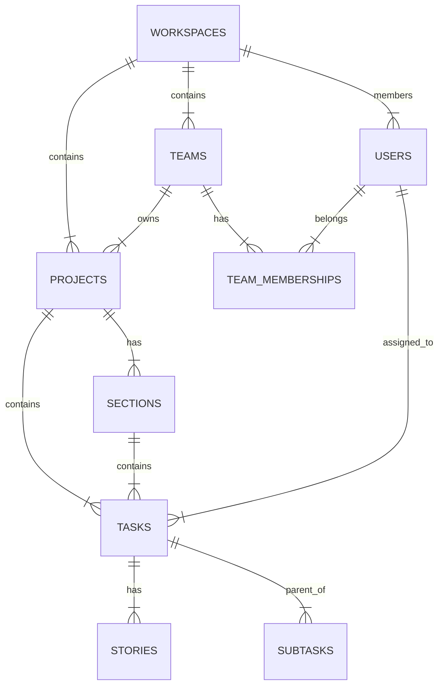

# Asana RL Environment Seed Data Documentation

## Section A: Database Schema

This section documents the relational schema used to simulate the Asana environment.

### Entity-Relationship Diagram

### Tables

#### 1. Workspaces (`workspaces`)
Top-level container for the organization.
- `id`: TEXT (UUID)
- `name`: TEXT
- `domain`: TEXT
- `created_at`: TIMESTAMP

#### 2. Users (`users`)
Members of the workspace.
- `id`: TEXT (UUID)
- `email`: TEXT
- `name`: TEXT
- `workspace_id`: FOREIGN KEY -> workspaces.id
- `role`: TEXT (Admin, Member, Guest)
- `department`: TEXT (Engineering, Sales, etc.)

#### 3. Teams (`teams`)
Groups of users.
- `id`: TEXT (UUID)
- `name`: TEXT
- `workspace_id`: FOREIGN KEY -> workspaces.id

#### 4. Team Memberships (`team_memberships`)
Join table for Users <-> Teams.
- `user_id`: FOREIGN KEY -> users.id
- `team_id`: FOREIGN KEY -> teams.id
- `role`: TEXT (Member, Admin)

#### 5. Projects (`projects`)
Collections of tasks.
- `id`: TEXT (UUID)
- `name`: TEXT
- `team_id`: FOREIGN KEY -> teams.id
- `workspace_id`: FOREIGN KEY -> workspaces.id
- `owner_id`: FOREIGN KEY -> users.id
- `archived`: BOOLEAN
- `color`: TEXT
- `start_date`, `due_date`: DATE

#### 6. Sections (`sections`)
Subdivisions of a project (e.g., "To Do", "Done").
- `id`: TEXT (UUID)
- `name`: TEXT
- `project_id`: FOREIGN KEY -> projects.id
- `order_index`: INTEGER

#### 7. Tasks (`tasks`)
The core unit of work.
- `id`: TEXT (UUID)
- `name`: TEXT
- `description`: TEXT
- `assignee_id`: FOREIGN KEY -> users.id
- `project_id`: FOREIGN KEY -> projects.id
- `section_id`: FOREIGN KEY -> sections.id
- `parent_id`: FOREIGN KEY -> tasks.id (for subtasks)
- `completed`: BOOLEAN
- `due_date`: DATE
- `created_at`: TIMESTAMP
- `priority`: TEXT

#### 8. Stories (`stories`)
Comments and system activity.
- `id`: TEXT (UUID)
- `target_id`: TEXT (Task ID)
- `text`: TEXT
- `created_by`: FOREIGN KEY -> users.id

#### 9. Custom Fields (`custom_field_definitions` & `custom_field_values`)
EAV pattern for flexibility.
- `custom_field_definitions`: Defines the field (e.g., "Priority", "Effort").
- `custom_field_values`: Stores the value for a specific task.

### Design Decisions
1.  **Custom Fields**: Implemented using an Entity-Attribute-Value (EAV) model (`custom_field_values`) linked to definitions. This allows different projects to have unique fields without altering the schema structure, mirroring Asana's flexibility.
2.  **Task Hierarchy**: Represented via a self-referencing `parent_id` on the `tasks` table. This is a standard adjacency list implementation, suitable for Asana's usually shallow nesting (Task -> Subtask).
3.  **Teams**: Critical for organizing projects and users, reflecting the "Organization" tier structure of Asana.

## Section B: Seed Data Methodology

### 1. General Strategy
We generate a core "Company" entity first, then hierarchically generate teams, users, projects, and tasks. Temporal consistency is maintained by generating a "history" timeline (last 6 months) and placing events on that timeline.

### 2. Column-by-Column Breakdown

#### Table: `users`
-   **source**: Faker library + Weighted Distribution
-   **methodology**:
    -   `name`: Generated via Faker.
    -   `department`: Weighted choice: Engineering (40%), Product (10%), Design (10%), Marketing (20%), Sales (20%).
    -   `role`: 5% 'Admin', 90% 'Member', 5% 'Guest'.

#### Table: `projects`
-   **source**: Pre-defined Templates + LLM Tuning
-   **methodology**:
    -   `name`: Selected from department-specific templates (e.g., Eng: "Q3 Core Infra", Mkt: "Holiday Campaign").
    -   `archive status`: 10-15% of projects are archived (completed initiatives).

#### Table: `tasks`
-   **source**: LLM Generation + Heuristic Rules
-   **methodology**:
    -   `name`:
        -   **LLM Prompt**: "Generate 5 tasks for a [Project Type] project in the [Section Name] stage."
        -   **Context**: Ensures tasks are relevant (e.g., "Draft Ad Copy" for Marketing, "Refactor API" for Eng).
    -   `description`: LLM generated rich text (Markdown). Varies in length.
    -   `assignee`:
        -   Weighted random selection from the Project's Team members.
        -   15% unassigned (backlog items).
    -   `due_date`:
        -   Clustered around Fridays (sprint ends).
        -   Start dates are 1-2 weeks before due dates.
    -   `completed`:
        -   Dependent on Section (e.g., tasks in "Done" section are 100% completed).
        -   Tasks in "Backlog" are 0% completed.

### 3. LLM Content Generation
-   **Provider**: Google Gemini API.
-   **Variety**: We uses varying `temperature` (0.7 - 0.9) and dynamic prompts that inject specific project contexts (e.g., "This is a high-stress Q4 deadline project").
-   **Prompts**: Located in `prompts/` directory.

### 4. Temporal Consistency
-   **Rule**: `created_at` < `start_date` < `due_date` < `completed_at`.
-   **History**: We act representing the "current state". Completed tasks have timestamps in the past. Active tasks have due dates in the future (or slightly overdue).

### 5. Relational Consistency
-   **Referential Integrity**: Enforced by SQLite Foreign Keys.
-   **Logic**:
    -   A user assigned to a task MUST be a member of the team that owns the project.
    -   A task in a specific section MUST belong to the project that owns that section.

### 6. Sources & Citations
-   **Team Sizes / Roles**: Based on typical SaaS org structures (Engineering 40%, Sales 20% - *State of API Report 2023*).
-   **Task Completion**: Pattern of 10-15% overdue tasks derived from *Asana Anatomy of Work Index*.
-   **Sprint Logic**: Due dates clustered on Fridays reflects standard Agile/Scrum bi-weekly sprint cycles.
